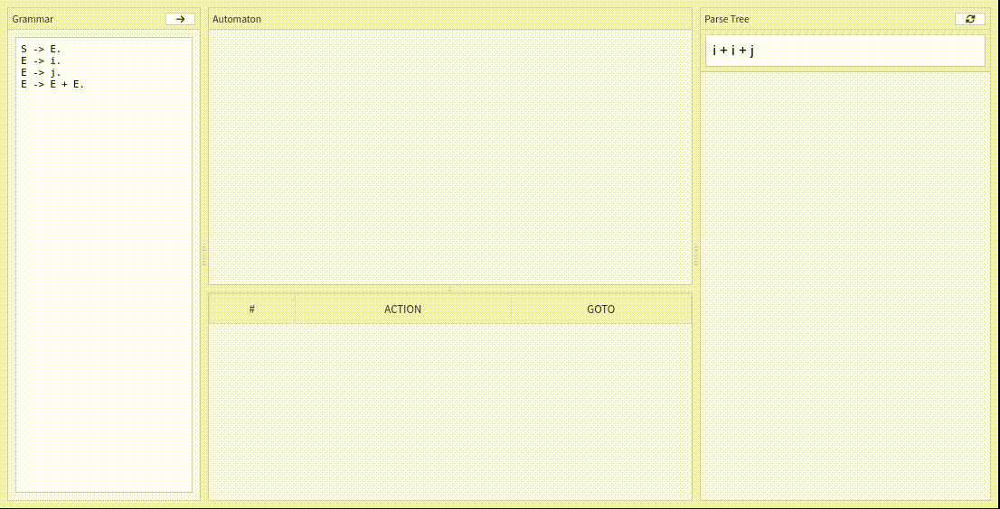

An interactive tool for experimenting with LR(1) grammars.

Important notes:
- Currently this uses [viz-js](http://viz-js.com/) in order to display the automaton and parse tree. This library is an emscripten compilation of `dot`, which itself uses a lot of memory. As a result, for medium-sized grammars, viz.js may complain that web assembly's memory is exhausted and be unable to draw the automaton. In the future, I intend to replace this with dagre-d3, following something like [this](https://dagrejs.github.io/project/dagre-d3/latest/demo/tcp-state-diagram.html).
- The internal workings of this project rely heavily on hashing for item sets. The current solution is rather crude because it hashes a string representation of the item set (as OCaml's built-in polymorphic hash - [murmur3](https://en.wikipedia.org/wiki/MurmurHash#MurmurHash3) - caused too many collisions). This is a hacky solution but since we're compiling OCaml bytecode to JavaScript, it's admissable (forgiveable) under a kind of "_when in Rome.._" policy.

TODO:
- Implement state merging on kernel items, enabling optional construction of LALR(1) automatons.
- It'd be nice if resolved conflicts were retained upon editing of the grammar to avoid having to reset them all after any change.
